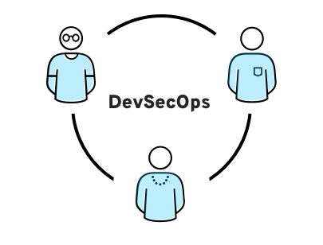
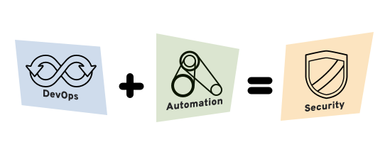

# DevSecOps Kubernetes MkDocs Demo

## What is DevSecOps?

DevSecOps stands for development, security, and operations. It's an approach to culture, automation, and platform design that integrates security as a shared responsibility throughout the entire IT lifecycle.

## DevSecOps vs. DevOps
DevOps isn’t just about development and operations teams. If you want to take full advantage of the agility and responsiveness of a DevOps approach, IT security must also play an integrated role in the full life cycle of your apps.

Why? In the past, the role of security was isolated to a specific team in the final stage of development. That wasn’t as problematic when development cycles lasted months or even years, but those days are over. Effective DevOps ensures rapid and frequent development cycles (sometimes weeks or days), but outdated security practices can undo even the most efficient DevOps initiatives.

Now, in the collaborative framework of DevOps, security is a shared responsibility integrated from end to end. It’s a mindset that is so important, it led some to coin the term "DevSecOps" to emphasize the need to build a security foundation into DevOps initiatives.

DevSecOps means thinking about application and infrastructure security from the start. It also means automating some security gates to keep the DevOps workflow from slowing down. Selecting the right tools to continuously integrate security, like agreeing on an integrated development environment (IDE) with security features, can help meet these goals. However, effective DevOps security requires more than new tools—it builds on the cultural changes of DevOps to integrate the work of security teams sooner rather than later.

This practice of prioritizing security from the earliest stages of planning and development throughout runtime is often referred to as shift left and shift right security. Implementing and automating DevSecOps with a shift left approach provides developer-friendly guardrails that can decrease user error at build and deploy stages and protect workloads at runtime. To shift right is to continue the practice of testing, quality assurance, and performance evaluation in a post-production environment.

## DevOps security is built-in

Whether you call it “DevOps” or “DevSecOps,” it has always been ideal to include security as an integral part of the entire app life cycle. DevSecOps is about built-in security, not security that functions as a perimeter around apps and data. If security remains at the end of the development pipeline, organizations adopting DevOps can find themselves back to the long development cycles they were trying to avoid in the first place.

In part, DevSecOps highlights the need to invite security teams and partners at the outset of DevOps initiatives to build in information security and set a plan for security automation. It underscores the need to help developers code with security in mind, a process that involves security teams sharing visibility, feedback, and insights on known threats—like insider threats or potential malware. DevSecOps also focuses on identifying risks to the software supply chain, emphasizing the security of open source software components and dependencies early in the software development lifecycle. To be successful, an effective DevSecOps approach can include new security training for developers too, since it hasn’t always been a focus in more traditional application development.

What does built-in security really look like? For starters, a good DevSecOps strategy is to determine risk tolerance and conduct a risk/benefit analysis. What amount of security controls are necessary within a given app? How important is speed to market for different apps? Automating repeated tasks is key to DevSecOps, since running manual security checks in the pipeline can be time intensive.

## DevOps security is automated

To do: Maintain short and frequent development cycles, integrate security measures with minimal disruption to operations, keep up with innovative technologies like containers and microservices, and all the while foster closer collaboration between commonly isolated teams—this is a tall order for any organization. All of these initiatives begin at the human level—with the ins and outs of collaboration at your organization—but the facilitator of those human changes in a DevSecOps framework is automation.

But what to automate, and how? There is written guidance to help answer this question. Organizations should step back and consider the entire development and operations environment. This includes source control repositories, container registries, the continuous integration and continuous deployment (CI/CD) pipeline, application programming interface (API) management, orchestration and release automation, and operational management and monitoring.

New automation technologies have helped organizations adopt more agile development practices, and they have also played a part in advancing new security measures. But automation isn’t the only thing about the IT landscape that has changed in recent years—cloud-native technologies like containers and microservices are now a major part of most DevOps initiatives, and DevOps security must adapt to to meet them.

## DevOps security is built for containers and microservices

The greater scale and more dynamic development and deployment enabled by containers have changed the way many organizations innovate. Because of this, DevOps security practices must adapt to the new landscape and align with container-specific security guidelines.

Cloud-native technologies don’t lend themselves to static security policies and checklists. Rather, security must be continuous and integrated at every stage of the app and infrastructure life cycle.

DevSecOps means building security into app development from end to end. This integration into the pipeline requires a new organizational mindset as much as it does new tools. With that in mind, DevOps teams should automate security to protect the overall environment and data, as well as the continuous integration/continuous delivery process—a goal that will likely include the security of microservices in containers.

Red Hat® Advanced Cluster Security for Kubernetes shifts security left and automates DevSecOps best practices. The platform works with any Kubernetes environment and integrates with DevOps and security tools, helping teams operationalize and better secure their supply chain, infrastructure, and workloads.

## Environment and data security
  - Standardize and automate the environment: Each service should have the least privilege possible to minimize unauthorized connections and access.
  - Centralize user identity and access control capabilities: Tight access control and centralized authentication mechanisms are essential for securing microservices, since authentication is initiated at multiple points.
  - Isolate containers running microservices from each other and the network: This includes both in transit and at rest data, since both can represent high-value targets for attackers.
  - Encrypt data between apps and services: A container orchestration platform with integrated security features helps minimize the chance of unauthorized access.
  - Introduce secure API gateways: Secure APIs increase authorization and routing visibility. By reducing exposed APIs, organizations can reduce surfaces of attacks.

## CI/CD process security
  - Integrate security scanners for containers: This should be part of the process for adding containers to the registry.
  - Automate security testing in the CI process: This includes running security static analysis tools as part of builds, as well as scanning any pre-built container images for known security vulnerabilities as they are pulled into the build pipeline.
  - Add automated tests for security capabilities into the acceptance test process: Automate input validation tests, as well as verification authentication and authorization features.
  - Automate security updates, such as patches for known vulnerabilities: Do this via the DevOps pipeline. It should eliminate the need for admins to log into production systems, while creating a documented and traceable change log.
  - Automate system and service configuration management capabilities: This allows for compliance with security policies and the elimination of manual errors. Audit and remediation should be automated as well.

## DevSecOps and platform engineering

Platform engineering is a discipline within software development that focuses on improving productivity, software delivery, and speed to market. It is distinct from DevOps because each practice comes up at a different time and focuses on a different set of problems. The overarching goal of platform engineering is to identify the pain points impacting development teams and mitigate them by providing common, reusable tools, services, and capabilities via an internal developer platform (IDP). Platform engineering can support DevSecOps practices by creating new capabilities for security, productivity, and standardization. The practice can also facilitate DevSecOps adoption and create a secure software supply chain for application delivery.

Page Source: https://www.redhat.com/en/topics/devops/what-is-devsecops